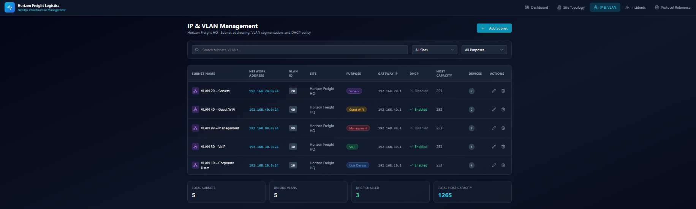

# horizon-freight-network-operations
Network+ aligned NOC infrastructure simulation with VLAN design, device monitoring, and incident management.
# Horizon Freight Logistics – Network Operations (NetOps) Infrastructure

This project simulates a Network Operations Center (NOC) environment for Horizon Freight Logistics.It models real-time infrastructure monitoring, VLAN segmentation, incident tracking, and root cause analysis in a small enterprise network.

---

## 🏢 Environment Overview
- 1 Headquarters Office
- 1 Warehouse Network
- Remote Users via VPN
- Fortinet Edge Firewall
- Core & Access Layer Switching
- Domain Controller (AD/DNS/DHCP)
- Segmented VLAN Architecture

---

## 🌐 Network Architecture
## IP & VLAN Management

The NOC platform includes centralized IP addressing and VLAN management to maintain clear network segmentation across the Horizon Freight infrastructure.

### VLAN Structure

| VLAN | Purpose | Subnet |
|-----|--------|--------|
| 10 | Corporate Users | 192.168.10.0/24 |
| 20 | Servers | 192.168.20.0/24 |
| 30 | VoIP | 192.168.30.0/24 |
| 40 | Guest WiFi | 192.168.40.0/24 |
| 99 | Network Management | 192.168.99.0/24 |

Each subnet is associated with a dedicated gateway and DHCP configuration where appropriate.  
This segmentation improves security, traffic management, and operational monitoring across the environment.
## Network Topology

The following diagram represents the simulated enterprise network architecture used in this Network Operations Center (NOC) environment. The design demonstrates VLAN segmentation, centralized switching, and perimeter firewall protection.

### VLAN Segmentation
| VLAN | Purpose        | Subnet            |
|------|---------------|------------------|
| 10   | Corporate     | 192.168.10.0/24  |
| 20   | Servers       | 192.168.20.0/24  |
| 30   | VoIP          | 192.168.30.0/24  |
| 40   | Guest WiFi    | 192.168.40.0/24  |
| 99   | Management    | 192.168.99.0/24  |

---

## 📊 NOC Dashboard Capabilities
- Real-time device monitoring
- Incident tracking by OSI layer
- Root cause categorization
- Device uptime tracking
- VLAN distribution analytics
- Top devices by incident frequency

---

## 🚨 Incident Simulation Model
## Sample Incident Investigation

Example: Slow Network Performance – VLAN 10 (Corporate Users)

Incident ID: NET-0009  
Severity: Medium  
Status: Open  

Symptoms:
Users connected to VLAN 10 reported slow access to internal applications and shared resources. Increased latency observed when pinging internal servers.

Investigation Steps:
1. Verified user subnet (192.168.10.0/24) connectivity
2. Checked switch interface utilization on Core Switch SW-01
3. Reviewed VLAN routing configuration
4. Tested connectivity to Domain Controller (192.168.20.11)
5. Identified intermittent packet loss on corporate VLAN interface

Root Cause:
Network misconfiguration affecting VLAN 10 routing path.

Resolution:
Corrected VLAN routing configuration on core switch and verified stable connectivity between corporate subnet and server subnet.

Time to Resolve:
18 minutes
## Incident Management Example

The NOC platform allows incidents to be reported, categorized by OSI layer, and tracked through investigation and resolution.

The environment supports simulated incidents including:
- VPN instability
- DHCP scope exhaustion
- Firewall misconfiguration
- Switch port failure
- Server service disruption
Each incident follows structured investigation and resolution documentation.

---

## 📈 Operational Metrics
Dashboard tracks:
- Device uptime percentage
- Open vs. resolved incidents
- Escalation rate
- Incident distribution by OSI layer
- Root cause analytics

---

## 🎯 Objective
This project demonstrates applied Network+ concepts including:
- Subnetting
- VLAN design
- Firewall rule logic
- Incident response
- Network troubleshooting methodology
- Infrastructure monitoring awareness
